<div align="center">

# Brisa

**An accessible React + TypeScript design system with themeable tokens, light and dark themes, and a live docs site.**

[](https://github.com/FabianoArthur/teste-claude-design/actions/workflows/ci.yml)
[](LICENSE)

**English** · [Português (Brasil)](README.pt-BR.md)

[**Live docs →**](https://fabianoarthur.github.io/teste-claude-design/)

</div>

<picture>
  <source media="(prefers-color-scheme: dark)" srcset="docs/assets/screenshot-dark.png">
  
</picture>

## What it is

Brisa (Portuguese for _breeze_) is a small design system: a set of **design tokens**, a **theme layer** and
**16 components**, documented on a site where every example is live and every page works in light and dark mode.

| Forms                                                                   | Overlays & feedback                        | Layout & data               |
| ----------------------------------------------------------------------- | ------------------------------------------ | --------------------------- |
| Button · TextField · Textarea · Select · Checkbox · Switch · RadioGroup | Dialog · Toast · Tooltip · Alert · Spinner | Card · Tabs · Table · Badge |

## Why it is interesting

- **Accessibility is tested, not promised.** Every component's test file runs [axe-core](https://github.com/dequelabs/axe-core),
  and keyboard behaviour (roving tabindex in Tabs, Esc in Dialog and Tooltip, Space/Enter in Switch) is exercised with
  Testing Library's `user-event`.
- **The palette is a contract.** A test parses `tokens.css`, resolves every theme's semantic colours and asserts
  WCAG AA ratios for each text/background and UI pair (4.5:1 and 3:1) in **both** themes. It also fails if the
  OS-driven dark block drifts from the forced dark theme. A colour tweak can't quietly break contrast.
- **Native first.** `<dialog>` with `showModal()` (top layer and an inert background for free), native `<select>`
  and radios. Custom ARIA only where HTML has no equivalent (tabs, switch, tooltip, toast).
- **Theming without re-renders.** Components read only semantic CSS custom properties; switching theme flips one
  `data-theme` attribute on `<html>`. The theme choice (light / dark / system) is remembered and survives blocked storage.
- **Zero runtime dependencies.** React is a peer dependency; everything else is CSS and TypeScript.

## Architecture

<picture>
  <source media="(prefers-color-scheme: dark)" srcset="docs/assets/architecture-dark.svg">
  
</picture>

```
src/
  tokens/        tokens.css (primitives → semantic, per theme) + the contrast contract test
  theme/         ThemeProvider, useTheme, pure theme resolution
  components/    one folder per component: .tsx, .css, .test.tsx
  styles.css     tokens + base + every component stylesheet
site/            docs site (Vite + React, hash routing for GitHub Pages)
scripts/         diagram generator for this README
```

## Getting started

Requires Node.js 20+.

```bash
git clone https://github.com/FabianoArthur/teste-claude-design.git
cd teste-claude-design
npm ci
npm run dev          # docs site at http://localhost:5173
```

Using the components:

```tsx
import { Button, ThemeProvider, ToastProvider, useToast } from 'brisa-ui';
import 'brisa-ui/styles.css';

function SaveButton() {
  const { toast } = useToast();
  return <Button onClick={() => toast({ title: 'Saved', tone: 'success' })}>Save</Button>;
}

export function App() {
  return (
    <ThemeProvider>
      <ToastProvider>
        <SaveButton />
      </ToastProvider>
    </ThemeProvider>
  );
}
```

> The package is not published to npm. Build it with `npm run build:lib` (outputs `dist/brisa.js`,
> `dist/brisa.css` and type declarations) or copy the source.

| Script                               | What it does                                                       |
| ------------------------------------ | ------------------------------------------------------------------ |
| `npm run dev`                        | Docs site with hot reload                                          |
| `npm test`                           | Vitest: behaviour, keyboard, axe and contrast tests                |
| `npm run lint` / `npm run typecheck` | ESLint (typescript-eslint, react-hooks, jsx-a11y) / `tsc --noEmit` |
| `npm run build`                      | Library (`dist/`) and docs site (`site-dist/`)                     |
| `npm run diagrams`                   | Regenerates the architecture SVGs                                  |

The only environment variable is the optional `BASE_PATH` used when building the docs for GitHub Pages
(the workflow sets it to `/<repository-name>/`).

## Testing and quality

```bash
npm test
```

- **Behaviour:** components are queried by role and accessible name, the way assistive technology sees them.
- **Accessibility:** axe-core on every component. Colour contrast is excluded from axe because jsdom does not
  paint; the token contract test covers it instead. jsdom has no `<dialog>` either: the test setup stubs
  `showModal`/`close`, and the Esc path is tested by dispatching the `cancel` event the browser would fire.
- **CI** (GitHub Actions, actions pinned by SHA, read-only permissions): format, lint, typecheck, tests, library
  build, docs build with the Pages base path, and a full-history gitleaks scan.
- **Deploy:** every push to `main` publishes the docs to GitHub Pages.

## Accessibility notes

Brisa aims at WCAG 2.2 AA. Automated checks catch a lot, but not everything: focus order in complex pages,
screen-reader wording and zoom/reflow still deserve a manual pass in your product.

## License

[MIT](LICENSE) © 2026 Fabiano Arthur
