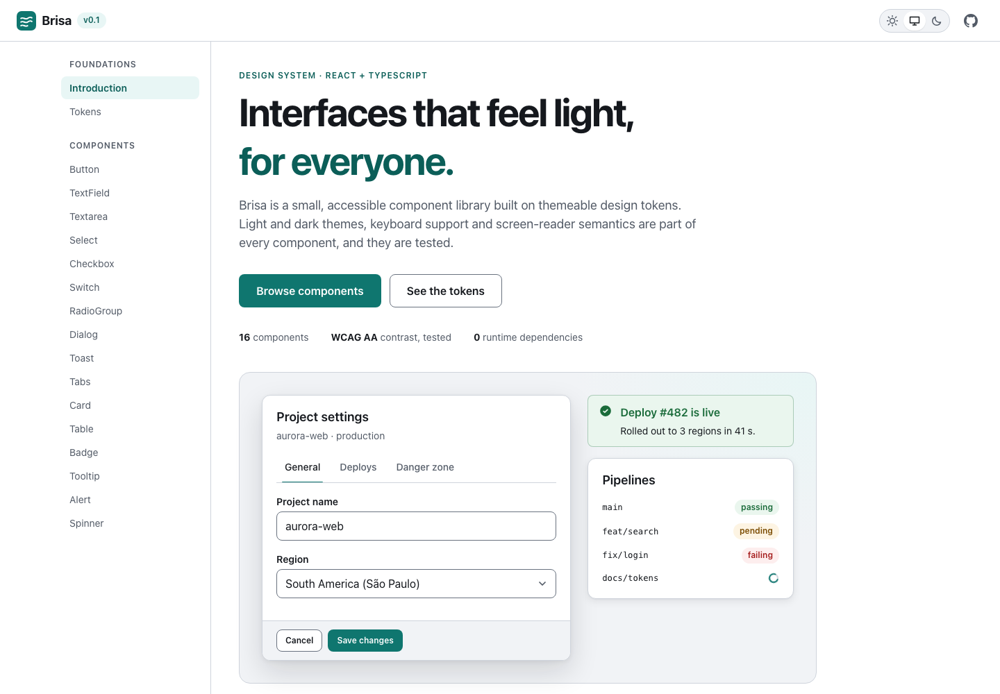

<div align="center">

# Brisa

**Um design system acessível em React + TypeScript, com tokens tematizáveis, temas claro e escuro e um site de documentação ao vivo.**

[](https://github.com/FabianoArthur/teste-claude-design/actions/workflows/ci.yml)
[](LICENSE)

[English](README.md) · **Português (Brasil)**

[**Documentação ao vivo →**](https://fabianoarthur.github.io/teste-claude-design/)

</div>

<picture>
  <source media="(prefers-color-scheme: dark)" srcset="docs/assets/screenshot-dark.png">
  
</picture>

## O que é

Brisa é um design system enxuto: um conjunto de **design tokens**, uma **camada de temas** e **16 componentes**,
documentados num site em que todo exemplo é interativo e toda página funciona no modo claro e no escuro.

| Formulários                                                             | Sobreposições e feedback                   | Layout e dados              |
| ----------------------------------------------------------------------- | ------------------------------------------ | --------------------------- |
| Button · TextField · Textarea · Select · Checkbox · Switch · RadioGroup | Dialog · Toast · Tooltip · Alert · Spinner | Card · Tabs · Table · Badge |

## Por que é interessante

- **Acessibilidade testada, não prometida.** O arquivo de teste de cada componente roda o
  [axe-core](https://github.com/dequelabs/axe-core), e o comportamento de teclado (tabindex itinerante nas abas, Esc no
  Dialog e no Tooltip, Espaço/Enter no Switch) é exercitado com o `user-event` da Testing Library.
- **A paleta é um contrato.** Um teste lê o `tokens.css`, resolve as cores semânticas de cada tema e confere as
  razões de contraste WCAG AA de cada par texto/fundo e de UI (4,5:1 e 3:1) nos **dois** temas. Ele também falha se
  o bloco escuro que segue o sistema divergir do tema escuro forçado. Um ajuste de cor não quebra o contraste em silêncio.
- **Nativo primeiro.** `<dialog>` com `showModal()` (camada superior e fundo inerte de graça), `<select>` e radios
  nativos. ARIA customizado só onde o HTML não tem equivalente (abas, switch, tooltip, toast).
- **Tema sem re-render.** Os componentes só leem propriedades CSS semânticas; trocar o tema muda um atributo
  `data-theme` no `<html>`. A escolha (claro / escuro / sistema) é lembrada e sobrevive a armazenamento bloqueado.
- **Zero dependências em runtime.** O React é peer dependency; o resto é CSS e TypeScript.

## Arquitetura

<picture>
  <source media="(prefers-color-scheme: dark)" srcset="docs/assets/architecture.pt-BR-dark.svg">
  
</picture>

```
src/
  tokens/        tokens.css (primitivas → semânticos, por tema) + o teste do contrato de contraste
  theme/         ThemeProvider, useTheme, resolução pura do tema
  components/    uma pasta por componente: .tsx, .css, .test.tsx
  styles.css     tokens + base + a folha de estilo de cada componente
site/            site de docs (Vite + React, rotas por hash para o GitHub Pages)
scripts/         gerador do diagrama deste README
```

## Como rodar

Requer Node.js 20+.

```bash
git clone https://github.com/FabianoArthur/teste-claude-design.git
cd teste-claude-design
npm ci
npm run dev          # site de docs em http://localhost:5173
```

Usando os componentes:

```tsx
import { Button, ThemeProvider, ToastProvider, useToast } from 'brisa-ui';
import 'brisa-ui/styles.css';

function SaveButton() {
  const { toast } = useToast();
  return <Button onClick={() => toast({ title: 'Salvo', tone: 'success' })}>Salvar</Button>;
}

export function App() {
  return (
    <ThemeProvider>
      <ToastProvider>
        <SaveButton />
      </ToastProvider>
    </ThemeProvider>
  );
}
```

> O pacote não está publicado no npm. Gere-o com `npm run build:lib` (produz `dist/brisa.js`, `dist/brisa.css` e as
> declarações de tipo) ou copie o código-fonte.

| Script                               | O que faz                                                          |
| ------------------------------------ | ------------------------------------------------------------------ |
| `npm run dev`                        | Site de docs com hot reload                                        |
| `npm test`                           | Vitest: testes de comportamento, teclado, axe e contraste          |
| `npm run lint` / `npm run typecheck` | ESLint (typescript-eslint, react-hooks, jsx-a11y) / `tsc --noEmit` |
| `npm run build`                      | Biblioteca (`dist/`) e site de docs (`site-dist/`)                 |
| `npm run diagrams`                   | Regera os SVGs de arquitetura                                      |

A única variável de ambiente é a opcional `BASE_PATH`, usada ao gerar o site para o GitHub Pages
(o workflow define `/<nome-do-repositório>/`).

## Testes e qualidade

```bash
npm test
```

- **Comportamento:** os componentes são buscados por papel (role) e nome acessível, como uma tecnologia assistiva os vê.
- **Acessibilidade:** axe-core em todo componente. O contraste de cor fica fora do axe porque o jsdom não pinta a
  tela; quem cobre é o teste do contrato de tokens. O jsdom também não tem `<dialog>`: o setup dos testes simula
  `showModal`/`close`, e o caminho do Esc é testado disparando o evento `cancel` que o navegador emitiria.
- **CI** (GitHub Actions, actions fixadas por SHA, permissões só de leitura): formatação, lint, typecheck, testes,
  build da biblioteca, build do site com o caminho base do Pages e varredura de segredos no histórico inteiro (gitleaks).
- **Deploy:** cada push na `main` publica a documentação no GitHub Pages.

## Notas de acessibilidade

O Brisa mira o WCAG 2.2 AA. Checagens automáticas pegam muito, mas não tudo: ordem de foco em páginas complexas,
texto lido pelo leitor de tela e zoom/reflow ainda merecem uma passada manual no seu produto.

## Licença

[MIT](LICENSE) © 2026 Fabiano Arthur
